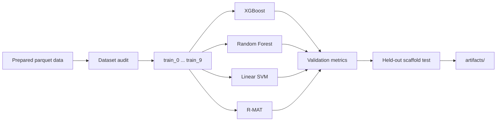

# RereplicationML

Reproducible machine-learning workflows for prioritizing compounds associated with the DNA re-replication phenotype. The repository contains prepared PubChem-derived datasets for MCF10A and SW480 cells together with XGBoost, Random Forest, linear SVM, and R-MAT baselines.

## What Is Included

- Prepared parquet datasets with SMILES, binary activity labels, molecular features, and predefined scaffold splits.
- XGBoost, Random Forest, linear SVM, and R-MAT binary-classification workflows.
- Dataset audit and independent evaluation scripts.
- A Conda environment definition.

For exact dataset counts, split details, and manuscript-consistency notes, generate the local audit with `python scripts/inspect_datasets.py`. A local `REPORT.md` may be kept outside Git for manuscript notes.

## Workflow



Classical baselines use 10-fold stratified grid search inside the combined `train_*` partitions. The predefined `val` and `test` sets are kept outside hyperparameter search and are reported as independent scaffold-split evaluations.

## Quick Start

```bash
conda env create -f environment.yml
conda activate rereplication-ml

python scripts/inspect_datasets.py
```

## Train Models

```bash
python scripts/train_xgb.py --dataset mcf10a
python scripts/train_rf.py --dataset mcf10a
python scripts/train_svm.py --dataset mcf10a
python scripts/train_rmat.py --dataset mcf10a
```

Replace `mcf10a` with `sw480` to train on the second dataset. R-MAT may download pretrained weights on first use. It uses CUDA only when the installed PyTorch build provides it.

## Evaluate a Saved Model

```bash
python scripts/check_xgb.py --dataset mcf10a
python scripts/check_rf.py --dataset mcf10a
python scripts/check_rmat.py --dataset mcf10a
```

## Outputs

Each run writes its model and metrics below `artifacts/`:

```text
artifacts/
  |-- xgboost/<dataset>/
  |   |-- model.json
  |   `-- metrics.json
  |-- random_forest/<dataset>/
  |   |-- model.joblib
  |   `-- metrics.json
  |-- svm/<dataset>/
  |   |-- model.joblib
  |   `-- metrics.json
  `-- rmat/<dataset>/
      |-- model.pt
      `-- metrics.json
```

## Repository Layout

| Path | Description |
| --- | --- |
| `data/mcf10a/raw.parquet` | Prepared MCF10A dataset. |
| `data/sw480/raw.parquet` | Prepared SW480 dataset. |
| `scripts/inspect_datasets.py` | Reports class counts and predefined splits. |
| `scripts/train_xgb.py` | XGBoost classification workflow. |
| `scripts/train_rf.py` | Random Forest classification workflow. |
| `scripts/train_svm.py` | Linear SVM classification workflow. |
| `scripts/train_rmat.py` | R-MAT classification workflow. |
| `scripts/check_*.py` | Evaluation of saved XGBoost, Random Forest, and R-MAT models. |
| `scripts/data_featurizer.py` | Optional generation of a new fingerprint parquet file. |
| `environment.yml` | Conda environment definition. |
